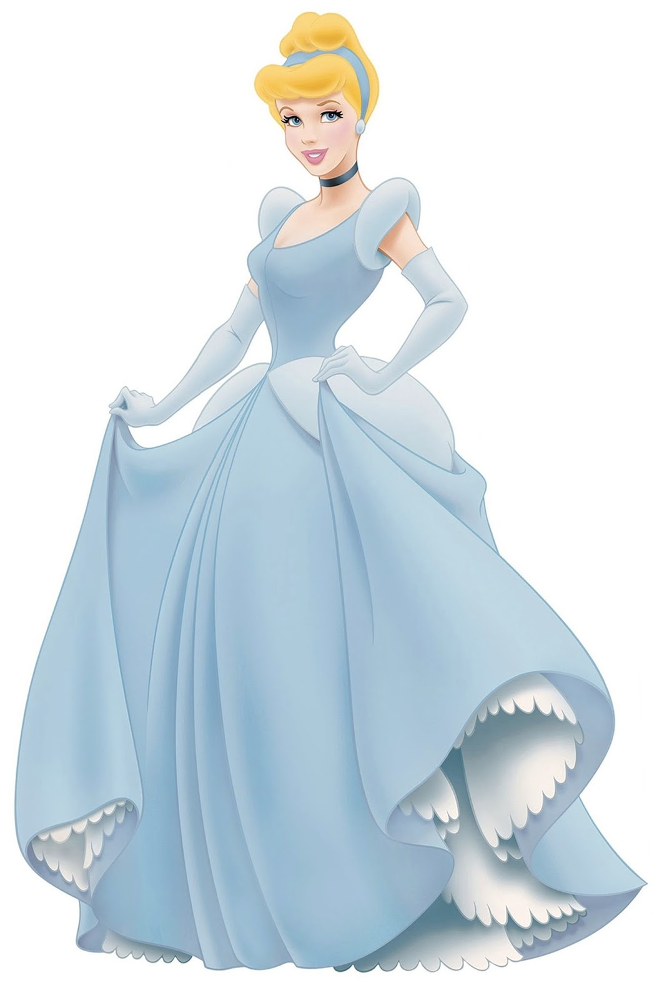
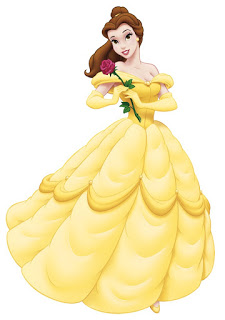
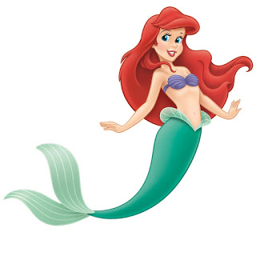
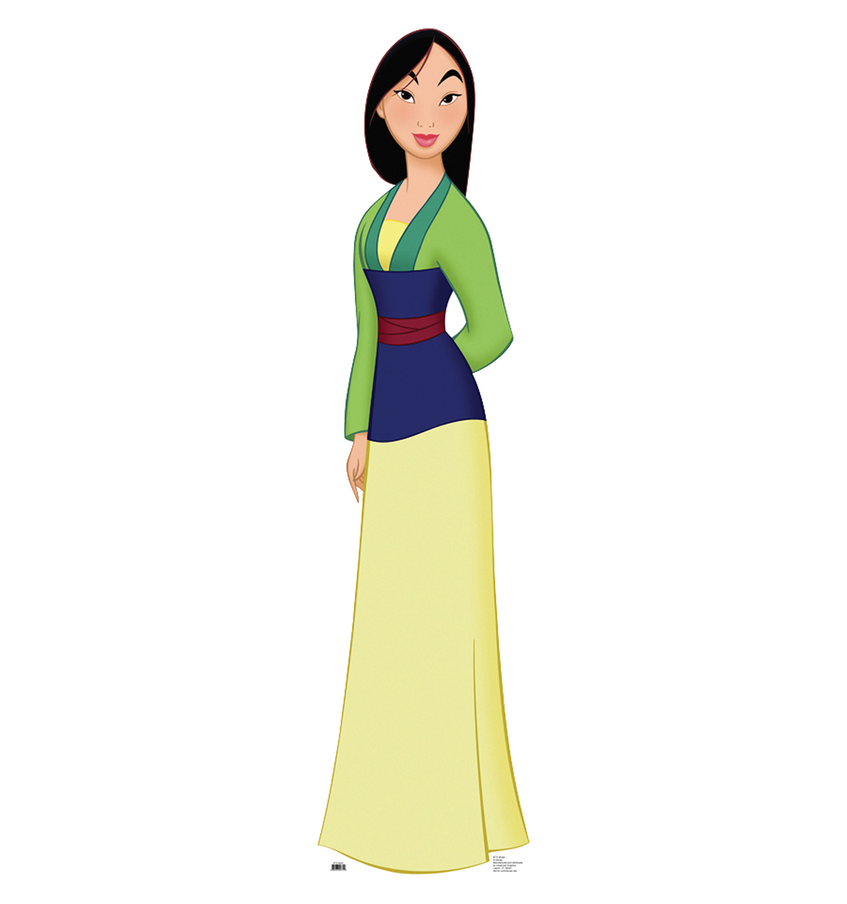
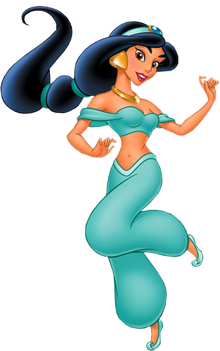
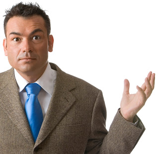
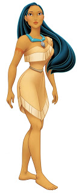
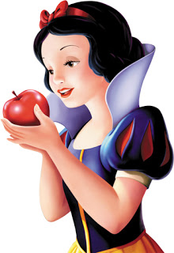
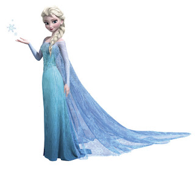

## You won't believe 6!

ZOMG you guys this is so cool! Some guy on the internet re-imagined all your favorite Disney princesses as guys named Steve, and the results are amazing!!! You'll never look at Disney princesses the same way again!

### 1 - CINDERELLA

Cinderella was a Disney princess from the Disney movie "Cinderella," in which she is the princess. I've always wanted to know what she'd look like if she was a guy named Steve -- and now we know:

### 2 - BELLE

Remember Belle? She was a princess in a Disney movie -- well she married a prince at the end so she BECOMES a princess by virtue of marriage like our very own Disney Meghan Markle -- so you love her more than life itself, right? Well prepare to have your MIND BLOW when you see her as a Steve!!

### 3 - ARIEL

Ariel (whose father is King Triton, so she's definitely a princess!), has her dream come true when she becomes part of Steve's world!

### 4 - MULAN

Mulan wasn't literally a princess in the movie "Mulan," I mean she flirts with a general guy at the end but even if she married him she still wouldn't technically be a princess. BUT SHE'S STILL A DISNEY PRINCESS BECAUSE WE SAY SO AND WE LOVE HER.

### 5 - JASMINE

Now, see, Jasmine actually is a princess, technically, because her dad is the Sultan. But she looks AMAZING as a guy name Steve! Wow!

### 6 - POCOHONTAS

Daughter of tribal chief totally counts as a Princess because why not? Say hello to Princess Steve!!!

### 7 - SNOW WHITE

Snow White was the first Disney princess so some would say that she is the BEST Disney princess. But that would BE DUMB BECAUSE EVERY DISNEY PRINCESS IS THE BEST DISNEY PRINCESS.

### 8 - ELSA FROM FROZEN

I know I said that every princess is the best princess but we all know thats not technically true because the BEST PRINCESS IS ELSA FROM FROZEN AND YOU CAN NEVER SAY ELSA YOU ALWAYS HAVE TO SAY ELSA FROM FROZEN. ELSA FROM FROZEN SINGS THE SONG AND YOU LOVE HER. YOU LOVE HER AND YOU WOULD DIE FOR HER IN A SECOND!!

Here she is as a guy named Steve:

---

Wow, isn't it amazing to see Disney princesses as things that aren't Disney princesses and yet somehow in their essence are still totally Disney princesses. DISNEY PRINCESSES CAN BE ANYTHING AND THEY ARE EVERYWHERE, DISNEY PRINCESSES ARE GOD.

Follow the links below to see Disney princesses as rocks, Disney princesses as forms of government, and Disney princesses as DIFFERENT Disney princesses!
