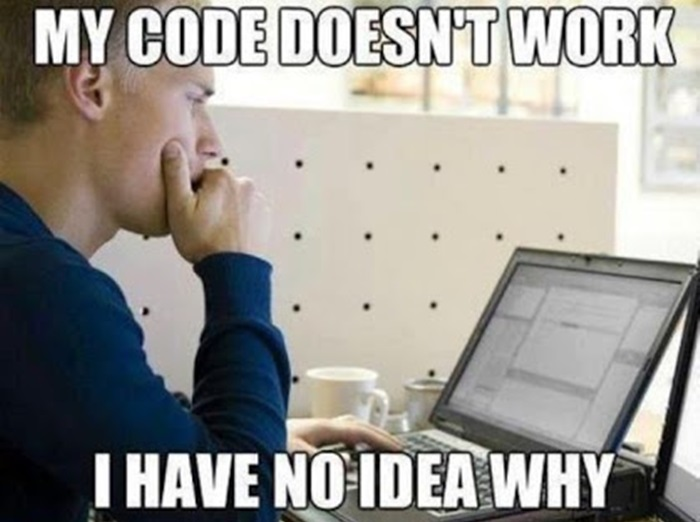

*It's going to be very easy to get discouraged. But you aren't alone!*

You can do this.

Learning to code will be both easier and harder than you think. That sounds like mystical mumbo jumbo, but it’s true.

You are learning a kind of language. Just like learning a new human language, there will be culture shock. You will want to run away back to familiar things, but you’ll never learn if you do.

You will feel dumb. You will think you are the only person who ever felt dumb while learning to code. You will think people who know how to code have some kind of magic powers that you just don’t have.

There are no magic powers. Professional coders felt the same way as you do when they were learning. They still feel dumb sometimes.

If your code doesn’t run without bugs on the first try, you do not suck at coding and it doesn’t mean everything you wrote is worthless.

You will never reach a level of skill in which you will always just magically write bug-free code. You will never reach a point in working with code in which you do not have to deal with bugs. Instead, you will get better at tracking down, spotting, and fixing bugs through time and practice, and a lot of staring at your code in confusion. Developing efficient debugging skills is more important than stressing over writing “perfect” code on your first try.

<figure class="float-left" style="width: 240px">

<figcaption>A large part of the process.</figcaption>
</figure>

When you get something to work, go back and make sure you understand why it wasn’t running before. Be very specific. Make a note of it. Understanding why code breaks is key to helping you more reliably know how code works. If you just move on because it’s working, it will take you a lot longer to learn things.

Code with other people who are learning to code. You’ll learn both from their experience and by teaching them what you know. You will see that other people are struggling too. Tell each other that it’s okay, and that you are getting this. Remind each other that this can be hard, and neither of you are dumb.

Like any language, there are conventions and common practices in coding. Learning these will help you to communicate more easily with other people who speak this language. Like any language, sometimes these conventions will feel arbitrary or illogical. Learn them anyway. One day, maybe, you can be a voice in the community to argue for changes in conventions. But for now you will be for better served by learning and adopting convention then you will be by immediately challenging or resisting it.

In the professional world, coding is not a solitary activity. It is a social and collaborative, done by teams of people working closely together. Learn to be flexible. Understand that there’s usually no one right way. Practice talking about code and explaining what the code is doing to other people. Learn to write your code in a way that is easy for other people to read. When assigning names, give names that make sense and represent what the thing is or does. Look up spacing, indentation, and naming conventions for the language you are learning and follow them — they are designed to make your code more readable.

You’ll see code online that looks flashy because it shortens a whole algorithm into one compact line that is almost impossible for the human mind to parse and would be incredibly difficult to debug. You will be tempted to think that this is what professional coders do and that this should be your goal. It is not.

Your code will not run a lot of the time. You will have error after error after error. It will take you hours to get a simple thing to work. If you see this as failure, you will be exhausted and demoralized very quickly. This is why a lot of people who try to learn to code give up. If, instead, you see the process of getting your code to work as an exciting challenge or puzzle and celebrate wildly when it finally works, you are already on your way to being a great programmer.

Writing code requires patience with yourself. Coding without losing your mind will require being kind to yourself and giving yourself positive reinforcement. The computer will not reassure you that you are doing well or that you were close that time, it will only tell you that your code didn’t work. It will be up to you to pat yourself on the back for steps forward and make the most of every success and to seek out companions on this crazy journey who will help encourage you. If you do not do this, you will burn out, give up, and convince yourself that you simply cannot code.

You *can* code.
