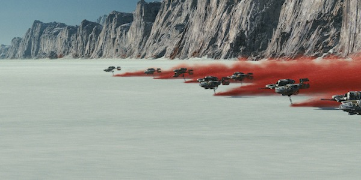

About a year ago I wrote my long-winded, unnecessarily detailed, and generally scathing critique of "Rogue One" as a way of processing both why such a silly action movie offended me so deeply and also why this space opera saga meant so much to me in the first place. The essay grew out of frustrating conversations with deeply loved friends and fellow-fans who disagreed with me on what makes the Star Wars universe so satisfying and compelling, and allowed me to put into words more carefully all the reasons why Rogue One let me down. In the interest of intellectual integrity and consistency, I felt it worthwhile to hold up the newest film to the same scrutiny and see how "The Last Jedi" measures up to my highly scientific (lol) standards.

My previous post lays out four core elements that to me define the essence of the Star Wars films that launched the franchise: 1) heroic, likable, relatable characters, 2) allegorical plot, 3) unique genre/tone, and 4) use of the symbolism and myth. It is these qualities, and not surface details like lightsabers, X-wings, or Darth Vader choking people, that actually makes something Star Wars. It's perfectly easy to make a movie that uses all the surface details, that makes an intense amount of surface references to the other films, but in its heart has nothing in common thematically or spiritually with the franchise -- in other words, Rogue One. Without making use of any of these four core elements, the film is a soul-less imitation of something it clearly does not really understand. It's like if I got on a stage and performed a scene from "Twilight" but tried to convince you it was actually Shakespeare because I happened to be wearing an Elizabethan outfit complete with ruff and an elegant codpiece. Of course it's Shakespeare! THERE'S A COD PIECE IN IT.

That's how Rogue One fans come across to me.

But we aren't here to talk about Rogue One. How does The Last Jedi hold up? It is, after all, it's own animal, wildly different in tone and direction than both "Rogue One" and in many respects its predecessor, "The Force Awakens." Rian Johnson was only too happy to take what JJ Abrams handed him and toss it over his shoulder -- quite literally.

Let's start with the first core element: heroic characters. Star Wars characters stick with us because they are relatable and flawed, even occasionally ridiculous and silly, but ultimately rise to their occasion and fulfill heroic arcs. This is one category where JJ Abrams did a fairly decent job in "The Force Awakens." He had the big task of introducing us to an entirely new set of Star Wars protagonists and trying to make room in our hearts for them alongside our old favorites, and ultimately I found Rey, Finn, and Poe pretty lovable. They were characters with a sense of humor who didn't take themselves too seriously, but who could have serious moments where they faced serious choices. They were rough sketches of characters, much as Luke, Han, and Leia were still rough sketches by the end of A New Hope, but they were a solid start. A compelling villain is also a key character in this kind of story, and Episode VII delivered spectacularly with the angsty Kylo Ren, the perfect inversion of Luke Skywalker who lived in the shadow of Darth Vader in much the same way as the entire film had to live in the shadow of the original trilogy. He was interesting. He was familiar but different. And he resonated with deep symbolic significance for our time.

The Last Jedi's job was to further develop these characters and their arcs. In some cases, it did only a mediocre job with this. I don't think Johnson was sure what he wanted to do with Finn and Poe, they felt extraneous to the story he was really interested in. Finn goes from wanting to run away to being a full-fledged participant in the Resistance, and Poe learns that true leadership requires restraint and looking at the big picture. Ok, fine, I guess. These are mini-arcs for characters who feel less important to the story than they did in the last film. Finn and Poe's relationship with each other (or with Rey) is not developed in any way which is truly a shame, as we would hope that going into the third act our main three players would have developed more nuanced, complicated views of each other. We get a new character, Rose, who was also likable in her way and who seems to be suddenly crushing on Finn by the end of the movie, but even those two don't seem to have gotten close in any kind of nuanced way through their experience. There's a reason these characters and relationships don't really go anywhere in this film -- the film isn't interested in them.

As with so many things in The Last Jedi, where the film (i.e., Rian Johnson) isn't interested, the movie falls flat. But where he is interested, it soars and sings. In this case, the key development is in the characters of Rey, Ben, and Luke. The almost arbitrary encounters between Rey and her nemesis Kylo could have been forced and lifeless -- they were not. Through this link we see the two of them go from confrontational to almost resigned to the other's presence to finally forming a kind of deep connection that neither has ever really had and both have longed for -- and it happens with the last person in the galaxy they expected. The complication of a relationship that had previously been purely antagonistic is both interesting and incredibly Star Wars. As Rey grows disillusioned with her hero of legend Luke Skywalker, she simultaneously comes to see signs of Ben Solo inside of Kylo Ren, and not only that begins to understand and relate to him -- and in this parallels Luke's relationship to Vader in a new and interesting way.

On the other side of this interesting connection is what Ben sees in Rey. Ben Solo's darkness is everything that Anakin Skywalker's should have been, had the prequels been competently written and directed. His pain and motivation are believable. His anger is frighteningly honest. We know Kylo Ren. He's the teenage boy driven to unspeakable acts by loneliness, fear, trauma, and an inability to deal with or express emotion. Kylo Ren is any of the young men who have recently taken a gun and opened fired on a crowd -- the fiction presents us with an interpretation of a sincere fear that plagues us in our society. He stands vividly in the mythology of Star Wars because we know the kind of monster he is, and we can painfully sympathize with him even while being horrified at his acts of violence. Ben's haughty dismissal of Rey in "The Force Awakens" has been complicated by the beginning of this film. She beat him, first of all, quite the humbling experience for a man who hides his insecurity with shows of pride and power. Fans who complain that there's no way Rey, who had never picked up a lightsaber before, could defeat a young man who had been training for years, miss the point. They have been clouded by the realism of the prequels, which tried to explain everything logically as though this was a real story about real people in a real world. This is a fairy tale -- the winner of a lightsaber duel is NOT the one who has trained the most. The winner of the lightsaber duel is the one whose will is stronger, the one who is most in tune with their place in the universe (with the Force). Kylo's will was torn to pieces by his murder of his father and he was unable to muster the focus and resolve to match Rey's, whose desperation honed her will to a sharp point.

Humbled by his defeat, when Ben Solo sees Rey through their connected moments, he forms a vulnerable connection to another human being for the first time in years. Rey sees through to the core of him, as nothing can be hidden from the Force. She sees him naked as much symbolically as literally. There's a part of him that needs and cherishes this connection, so much so that he's unable to allow his master to kill her. But the twist is that, unlike Anakin, this newfound connection to another does not save him from the darkness -- it only drives him further into it. He needs her. I am incredibly grateful that this connection and need is never characterized as romantic or sexual just because they happen to be oppositely gendered characters, a choice that speaks volumes as to the originality of Rian Johnson's vision. The connection is strong and Ben genuinely wants Rey to rule the galaxy as his equal partner and gender is irrelevant here. Two souls have brushed up against each other. Twisted by his pain and need, he's even willing to emotionally brutalize and cripple her to control her -- and anybody who has seen an unhealthy relationship between two friends or partners can attest to the stark reality this embodies. "You're nothing," he tells her, "Nobody cares about you, only me. I'm the only friend you have." This desire to control and manipulate and own in order not to be left alone is the Dark Side in its rawest form, far scarier and more real to us than Snoke's fancy displays of power.

The reveal of the non-importance of Rey's parentage was exactly the right creative decision and one of the highlights of the film. That moment will forever live in epic Star Wars history every bit as shocking and thrilling and so damn right as "I am your father." When Vader reveals Luke is his son, we are horrified even as, like Luke, we know in our hearts that it is true. So too with Rey -- all the months of speculating who she could be, how she fit into this family saga, theories ranging from the the bizarre (she's a Kenobi! She's Emperor Palpatine! She's Anakin reborn!) to the likely (I was pretty sure they were just gonna make her Ben's sister) but none of these alternatives satisfies quite so much nor fit Rey's character arc more perfectly than to discover that her driving motivation -- her absolute conviction that she has a family somewhere that cares about her and whose identity will reveal her own -- was based entirely on delusion created by a traumatized, abandoned child. The reveal lands solidly, though its slightly watered down by the fact that, unlike Luke's shocking discovery in Episode V, there's like an hour of movie after it. But that's another issue. That moment in its isolation is perfectly delivered.

The other character arc Rian Johnson is interested in, and rightfully so, is that of our erstwhile protagonist Luke Skywalker. After decades of waiting to see him on screen again and especially after the bold tease of "The Force Awakens", we finally got to reunite with our hero of childhood. After all those years, the hype was insane. How could anything Luke do in this movie live up to that much expectation? The answer is, of course, that it can't -- which is why you don't even try, which is why you show that Luke suffers under the weight of his own legend and celebrity as the movie itself does with the hype of its predecessors. I am surprised, a bit, to hear some fanboys complain about Luke as the moody, jaded, failed teacher. I thought these fans liked their precious Extended Universe! The theme of Luke struggling to be a good teacher and often failing has been explored in several EU novels, and it makes sense. Being a good teacher is difficult,  the responsibility of guiding someone through adolescence and into maturity and adulthood is a fragile and heavy burden. Star Wars has always been interested in the relationship between teachers and students, and the idea of the master who failed to pass on his wisdom to a pupil is baked right into the core concept of the very first film. It makes even more sense for Luke, who was barely ever even trained himself. Somehow he was supposed to become a wise teacher and master and he just had to figure out how to do that with very little guidance. Watching Ben Solo drift away from him meant Luke had to come face to face with his own shortcomings in a whole new way. Defeating the Empire is one thing, getting through to a troubled teen is a problem of a whole other kind.

This is parallelism done right. JJ's attempts at parallelism in "The Force Awakens" come off more like simple paint-by-numbers copying, but here our familiarity with Luke's backstory and the previous films enhances our understanding of his arc. Luke is fully aware of the irony that he has basically turned into Obi-Wan, in exile after failing as a teacher and knowing his former student has gone on to wreak chaos and destruction in the galaxy. When Artoo plays the legendary message from Leia begging help from General Kenobi, he can't help but realize what he's become. His confession about the night he was tempted to strike down Ben before he could turn to evil was supremely human and actually fits Luke's character perfectly. When faced with a vision of evil in the cave on Dagobah, he lashed out and tried to destroy it -- a reaction that Yoda referred to later as "his failure." It's ever been Luke's weakness to brashly want to lash out and squash the darkness as though it were some kind of evil Other outside of himself, forgetting for a moment that the lashing out itself IS the evil. The revelation of the cave on Dagobah, that the evil he wanted to destroy was a part of himself, was inside himself, is mirrored by the outcome of that night at Ben Solo's bedside. His fear that Ben would go to the Dark Side was itself a temptation of the Dark Side, a temptation inside everybody including Jedi Masters who have faced it again and again. Its his brush with that temptation that becomes the trigger that sets Ben off down the very path Luke had feared he would go. Rey takes him to task for this failure with all the indignation of youth, and Luke says nothing in his defense. He knows she's right, and despite all his years and experience our Master Skywalker is still unable to deal with this failure and guilt. Knowing that he helped create a monster like Vader must have felt like all his previous battles were for nothing. How many parents swear they will raise their children better than their parents raised them, only to make so many of the same mistakes and pass down the family traumas?

This is heavy stuff. But it suits the characters and the themes of the saga absolutely perfectly. Luke is still somehow Luke under that gruff exterior, displays a grumpy humor that hints at his former self, and when he smiles at Artoo and calls the droid by name it felt like being reunited with an old friend. Sure, they've changed. They aren't how you remember. Time has not been kind to them. But that's the friend you grew up with at the core, straight out of your memories, bursting through all the nostalgia and fully realized again. I'll admit that I wept. I knew Mark Hamill was in this movie, of course, but I never dared hope that I'd actually get Luke, my Luke, back. So whatever other flaws the movie has I have to give Johnson credit for those wonderful moments where he managed to do the impossible. Credit also goes to Hamill himself, of course, whose performance in the whole film is true gift.

The ending Johnson gave to the character of Luke Skywalker was beautifully filmed and had a nice symmetry -- but felt like wrong ending to the arc of the character as sketched out in the movie up until that point. I'm convinced that in an original draft of the script Luke actually survived, as his sudden union with the Force / death seemed like a hard turn from where the character was progressing. Why have a reveal that Luke wasn't even there the whole time during the fight with Kylo if, well, actually he's just gonna die anyway? Having Luke sacrifice himself to buy the Resistance time makes sense, I suppose, but not filming it in such a way where you first feel nervous that Luke is in danger and might die, then experience the relief and pleasure of finding out he never was in danger at all and the whole thing was an elaborate feint, then experience a kind of "oh, well why did any of that matter then" disappointment when he dies anyway.

And why did he die? From the exertion of astral projecting through the Force, I guess? To quote Han, "THAT'S NOT HOW THE FORCE WORKS." This movie itself in previous scenes lays out a view of the Force that disagrees with the very premise that "over-using" the Force would somehow kill you. Unless it wasn't that effort and, as some of my friends have suggested, it was Luke willingly letting himself become one with the Force because he was finally at peace? I don't buy it. The whole progression of Luke's character arc up until the final moment when he disappeared had been one of "your story isn't over," and "you still have things to learn," "learn from your mistakes," and "there's still work to do." I'll discuss this more when I get to the symbolism and myth of the film, but I can't stand it when a movie kills off a character just for dramatic payoff when there's no logical reason that person needed to die, and I'm a bit tired of movies showcasing older characters whose only real purpose is to die off because only the young characters actually matter. Han's death didn't feel cheap. It was tragic. It fit the themes of the saga. It was a result of the decision he made to face his son, a decision he knew was risky, and the decision Ben made to try to "kill the past" and the light still flickering inside his soul. The son facing the father is a core element of Star Wars. Luke's felt... extraneous, however beautifully filmed. In it's way, it attempts to be a bit like Obi-Wan's sacrifice, but it was not set up in the same way. It's possible, of course, that he'll still be in Episode IX and that we'll get a little more completion to his arc. But up until the moment Luke faded away I was 100% perfectly happy with how the film had treated his character and then suddenly I felt cheated. It felt like it was an arbitrary decision in an arc that had been very carefully constructed up until that point.

But on to the second element of Star Wars films: allegorical plot. Each movie in this franchise is full of action adventure. We got to get the thing to stop the thing to save the galaxy. Nothing revolutionary in that, most action films follow a similar structure. What made the original trilogy stand our and last in our memory is the unique way in which it is able to get us to be absolutely invested in the outcome even though this is an entirely fictional galaxy full of entirely fictional people. It does this through its layering of both the personal drama (Luke vs Vader) together with the epic (the Rebellion vs the Empire). Each conflict reinforces, enhances, and serves as a symbol for the other. Here the Last Jedi does a fairly admirable job (with some caveats). The story of this film is the story of darkness and despair slowly but surely grinding down hope. As Ben Solo seeks out every last spot of weakness in his soul and any last vestige of the boy he once was in order to obliterate it, so too does the First Order relentlessly chase down the Resistance and slowly whittle it down until, by the end of the film, it consists solely of a small group of people who fit comfortably inside the Millenium Falcon. Though beaten and weakened and slowly drained of energy and resources, the hope the Resistance represents can't quite be snuffed out, and Leia in all her wisdom is certain its still enough to burn away the First Order's oppression.

The symbolic nature of this chase and attrition is just interesting enough for me to overlook silly plot details like the Resistance ships being able to stay "just out of laser range" for hours and hours and the sudden concern about fuel usage in a franchise where this has not ever really been an issue before. Not to mention how communication while in hyperspace works or, for that matter, how you track ships through hyperspace (the details of the "thing" the First Order was using to do that seemed very vague), or why a base with no escape route seemed like a good idea to make. Plot hand-waves like this are fun to joke about (and I'll be the first to make the jokes) but they are very much not the point.

I've come to the conclusion that there are two kinds of people: people who watch the Death Star trench run in Episode IV and see a thrilling allegory where Luke learns to trust his instincts and surrender in order to succeed, and people who watch it and wonder why such a huge battle station would have such a obvious flaw like a small thermal exhaust port (only two meters wide, mind you) that could allow the entire thing to be blown up. I will never understand why people in the second category became Star Wars fans, but they did, and then somebody made a movie called Rogue One in order to make those people happy and the rest of us miserable. Most of us recognize that the logic of the thermal exhaust port is very much not the point, any more than the logic of Achilles' vulnerable heel or the Wicked Witch of the West's severe allergy to water is the point.

The opening gambit of taking on the dreadnought was one the first action sequences in ages that actually had me on the edge of my seat, and I felt the raw desperation of the Resistance in the face of overwhelming odds. The movie was really good at evoking that feeling -- unfortunately, it over-uses it. We have just one too many "heroes last stand" moments and by the end I was feeling like "ok here we go again" when the Resistance squares off against yet another overwhelming force. I get that in some respects this was intentional -- the grueling, exhausting battle for survival in which every step forward is fought for fiercely and paid for in sacrifice. But I can't help but think that if the movie had been just one epic sequence shorter and left me wanting more I would have stayed engaged more deeply in the world of the film. In general, the movie was just a bit too long because sections of it felt unnecessary.

About that. So the Canto Bight subplot has received a lot of flak, and I can understand why. It felt like it was taking place in an entirely separate movie, both visually and plot-wise, and struggled to justify its existence in the film. On the surface, I can appreciate what it's trying to do. When Rose said it was filled with the most terrible people in the galaxy, I was fooled along with a lot of people into expecting some kind of wretched hive of scum and villainy like we've seen so many times in Star Wars before -- the reveal that this was a fancy place full of rich people was fairly delightful. Unfortunately the plot goes downhill from there. There are lots of antics in the casino, they never make contact with their master codebreaker they were there to find in the first place, and then Benicio del Toro shows up and its sort of like ok what are we doing here, Rian Johnson? Where are you going with this? The idea -- that we are going to show that there are forces in the galaxy that profit from the constant fighting, and that Rose and Finn's heroics inspire a new generation of future freedom fighters -- is not exactly terrible, its just a bit awkwardly executed. Not to mention that the sudden political complexity of war profiteers, while making a point that I agree with whole-heartedly on a political level, feels weirdly realistic in a movie that in every other plot line is fantastical. Fantasy represents real-world problems allegorically, but straight up war profiteers wearing top hats and playing in casinos stops being an allegory. It's the same kind of too-on-the-nose adaptation of real-world concepts that gave us Dexter Jettster and his 50's style diner on Coruscant in Attack of the Clones (ugh).

And that's the point -- Star Wars works best when it stays in the world of the fable that it is. Whenever it has tried to transgress genre and style, it falls flat. Canto Bight stepped out of fantasy and into... I don't know. It wasn't sure what it wanted to be. I can appreciate the goal but not the execution. It really just doesn't seem like Johnson had any idea what to do with Finn during this movie. As I said before, this is really the biggest disappointment for me in the entire film, as I was looking forward to a more interesting development for his character.

My other new favorite character, Poe, also had a plot line that struggled a bit though not nearly to the same extent as Finn's.  (WHY WOULD YOU SEPARATE THESE TWO CHARACTERS FOR ANOTHER FILM, WHAT KIND OF MONSTER DOESN'T WANT TO SEE MORE FINN/POE?) I'm a fan of the wise-cracking hot shot archetype, and I think Poe does a great job embodying that kind of character. It totally makes sense that his arc would include having to adjust from being a fly-by-the-seat-of-your-pants fighter pilot to learning what kind of restraint leadership entails. It almost feels like he's being groomed by Leia to be a future leader in the Resistance, and their boss/employee but also mother/son-ish relationship is interesting. It's nice to see Leia forming relationships with other characters -- unlike The Force Awakens, which wasted Carrie Fisher's potential by basically making her Han's ex-wife and not letting her be a character on her own. She really delivers in this movie and her early loss and thus absence from the next film is such a tragedy that I can't even process it.

So, Poe doesn't trust authority and makes rash decisions. Ok. Then this plot kind of goes bonkers, but in a kind of fun way, with Poe growing suspicious that purple-hair Laura Dern is too incompetent to really save the Resistance and even going so far as to carry out a mutiny. Internal fighting within the Resistance in the face of their extinction makes sense and is interesting, and I think we were supposed to see that Poe was once again making a knee-jerk decision without really thinking it through. But it comes off fairly extreme, and I struggled to believe that Leia and Holdo would be so calm about his mutiny once it was all over. "Oh, that lovable scamp, he backstabbed the entire chain of command and almost got us all killed, I like him." Leia has always had a thing for bad boys, but come on. She slapped him across the face for less earlier in the movie.

But at least it feels like the Poe/Holdo's storyline matters to the overall plot. What did Finn and Rose actually accomplish with their whole escapade? Really, the only thing they accomplished is inspiring the slave children on Canto Bight, which Rian Johnson and the movie seem to be suggesting made the whole thing worth it. And on an allegorical level, I appreciate that. But film-making wise it felt like an afterthought,  a bit like a consolation prize to reassure us that this subplot was important. I think this is where the movie gets my harshest critique, but I don't want to dwell on it too much. In many ways it more than made up for this weak storyline with strong choices in other areas.

On to element #3: genre and tone. Apart from the strange deviation of Canto Bight, the movie feels like an epic fairy tale in all the best ways. It (mostly) knows it's fantasy, and not science fiction. The core arcs and tone are (in general) there. The flashback sequences telling us the backstory between Luke and Ben are filmed in a dream-like, magical style, like something out of the Lord of the Rings. The highly stylized interpretation of that memory -- the shadows on Luke's face, the close-up on Ben's fear-filled eyes, the implosion of the hut as Luke screams out to try to fix this misunderstanding, to undo what he's done... gah, it was just perfect. PERFECT. I wanted to stand up and applaud. The campiness of Leia's sudden space resurrection admittedly gets a bit cringe-y on a re-watch. But it was such a shocking turn of events that I barely had time to process it at the time, I was too busy trying to convince myself that I was actually seeing what I was seeing. I'm rarely surprised in movies these days, so that was fun. And it was trying to be magical and mythical and majestic and fantastical, the way Star Wars should be. So however hokey the execution (I think it was mostly filmed to a be a spectacle in the 3D version) I still applaud the attempt.

In terms of tone, The Last Jedi succeeds because it delves into heavy subject matter and attempt operatic, epic themes while still not taking itself too seriously and retaining some of the campy playfulness that made the original trilogy so much fun. It's the first Star Wars film in ages in which the parts that were funny were pretty much genuinely funny and not awkward or cringe-inducing (The Force Awakens had some success at this as well, another reason it ended up working as a film for me despite its flaws). That sense of humor might have been the MOST disturbing thing missing from Rogue One, which was uniformly angsty, and plays a large part of making the tone of Star Wars so familiar and comforting. How could a movie this dark still make me laugh this much? It's great. Luke being grumpy with Rey while trying to train her was the best -- give me a whole movie of that please -- and even elements I had been a bit nervous about going in (the Porgs, for example) never overstayed their welcome. I did not feel like the humor was thrown in for the 6 year olds in the audience and catering directly to their level, as I did through all of the prequels. Most of the humor involved and deepened the characters involved.

To even throw in humor between Rey and Kylo Ren, that's bold and exciting. "I'd really rather not do this right now," Rey says. Kylo's droll, sighing response, "Yeah.... me either." He's getting dressed after showering off the blood from his latest rampage, one assumes. It's inconvenient timing for the both of them, and that's funny. That humor lets the silliness of the whole thing, the whole franchise, breathe and settle and stop from becoming the cringe-inducing mess that the prequels were. You cannot take this too seriously (listen up, fanboys). But the humor has to be earned and it has to be actually funny. I don't know why exasperated space nuns clicking their tongues at a horrified and embarrassed Rey is so funny to me. But it was.

And thus we arrive (at last) at element #4: unique use of myth and allegory. If the original trilogy was Luke's coming-of-age story mythologized, and the prequels are (I guess) Anakin's tragedy, then this new trilogy appears set to be a kind of blend of the two. We are given two parallel figures in Rey and Poe, the one ascending as she comes of age into adulthood and wisdom, the other sinking further and further into desperation and despair. Both tales mirror that of myths and legends told by humanity since like forever.

This film gave us Rey's counterpart to Luke's trial in the cave, her descent into the dark grotto and vision there. A literal descent is a key part of the hero's journey -- often depicted in myths as a cave, as with Luke on Dagobah, or a fall, as when Luke plummets into the abyss on Bespin. Here Rey drops down into dark water and approaches a mirror-like surface, in which she becomes convinced she will see her parents. Instead, she sees only herself reflected infinitely into the unknown. This is a bit more obscure symbolism than Luke seeing his own face in Darth Vader's mask, but its definitely running in a similar vein, and the grotto is definitely the same kind of place of dark power and knowledge like the cave of Dagobah. When Luke asks Yoda what is inside the cave, Yoda replies, "Only what you take with you." This is the revelation of these places of darkness, that they show you yourself - they do not answer the question you come in asking, but the deeper question you didn't even think to ask. Where Luke sought to find the truth of his enemy and was instead shown the truth of himself, Rey seeks to know the truth of her story, her parentage, only to be shown herself, just herself, as far as the eye can see. There are a lot of ways to interpret this, but one interpretation I like is that this foreshadows the revelation that her parents were nobody important. She comes to this place of dark wisdom she is shown an intimation of the truth that she's afraid to face, the same truth that Maz Kanata tried in a more gentle way to give her in the previous film: that her conviction that her family will return and give her life meaning is a fairy tale, and she has only herself. She is all she has, and all she needs. The line of infinite clones of herself suggests she is part of a great unending chain of life, or even the next in an unending chain of Jedi who give tangible presence to the living Force.

Speaking of which, the mythic use of the Force in the film was a welcome change in a franchise where it has become little more than a superpower that makes Jedi and Sith super badass. The original films maintain an aura of mystery, of almost religious mysticism around the Force, of which the powers of a Jedi are only a dim reflection, not the sum. It was a little disappointing to only get one session from Luke instructing Rey, but at least it was really really good. When he asks her what the Force is, she replies in much the way many fans would - its a cool power that makes a Jedi do cool stuff. Luke snorts derisively, as well he should. What follows is a meditation on mysticism that is mirrored in many world religions, a communion with the awesome totality of creation, of life, of the power and energy that dwells in all things, even (and here is the part of crucial revelation) in you. Life and death, light and darkness, creation and destruction, all dwell inside you with the same power that they exist in all the universe. It is the Jedi's wisdom to recognize this and be open to it, so that these forces may be balanced inside her soul.

I get very annoyed by extended universe discussions of "grey Jedi," Force users who walk the fine line between the Light and Dark side. This idea grows out of a perception of the Force in the framework of a very western good/evil dichotomy: there is the Light Force and the Dark Force, and these are in total opposition. We instinctively know that this is a simplistic view of something mystical, so it's easy to become interested in figures who transcend the good/evil opposition and find a balance in both. The problem with this view of grey Jedi is that this is exactly what the Jedi are supposed to be, figures who find balance in the Force within themselves. The Jedi are monks and not priests. The films do not refer to the "Light side" because there is no Light side. There is only the Force. The "Dark side" is an imbalance, a fascination with and addiction to only part of what the Force is. Luke is disturbed by Rey's immediate fixation on the dark place on the island not because she's supposed to repudiate it and avoid it forever, but because such immediate interest suggests her soul is already imbalanced, her interest in the darkness already out of proportion. He's seen that before, and it did not end well. The film's meditation on the inherent duality of the Force is exactly on target with the original intention of the early films and only underscores the relationship between Rey and Ben, who are figures of "light" and "darkness" intertwined with each other much like the yin and yang.

The mystery of the Force and the Jedi is furthered by Yoda's visit to Luke -- what a treat to have the real Yoda back, the trickster god, the mystic who laughs with maniacal laughter born of his inner wisdom. The "destruction" of the Jedi texts is a symbolic act straight out of myth, weighty with meaning. Luke in his anger wishes to destroy the Jedi's legacy, only seeing his own failure with Ben reflected throughout Jedi history. Amused, Yoda destroys them first. The texts, Yoda reminds Luke, don't matter in and of themselves. The books themselves are not holy (pay attention, Bible literalists!) but only the truths to which the books point. The truth of the Force stands beyond the tradition of the Jedi. It doesn't live in the past at all, but it is always now, constantly reborn, refreshed, taking new forms, but always the same. Not only does this have weighty religious symbolism, but it also almost feels like Yoda is teaching us a lesson about Star Wars itself. All the details you memorized and the lore you've accumulated mean nothing, Yoda tells us, the magic is not in those things. You have confused the books ABOUT the Force for the Force itself.  And in this teaching Yoda reveals himself as the Zen master he was always meant to be -- not the suddenly wild and wacky lightsaber dueler the prequels made him out to be. Yoda is the soul of the Jedi -- and he knows more than anyone that "war does not make one great."

If Rey's story is cut from the cloth of coming-of-age myths and Luke's from Zen-like meditations on the meaning of truth, Ben Solo's is drawn from mythic tragedies. He is flawed, he is wounded, he is suffering, and from this is born his desperate need to control the galaxy and be feared and obeyed. Fans who have come to really like Sith characters in the movies because they are "so cool" have largely found themselves disappointed with Kylo Ren, because here (at last!) we have a character whose villainy is not idealized or romanticized. He is, in fact, utterly pathetic. The harder he tries to become evil and powerful, the more we can see that he's nothing but a "boy in a mask." The consequences of his actions are still terrifying and heart-breaking, but all the more so because we know at the heart of the monster is just a wounded child. Whenever he reaches out, whenever he opens up, he only digs himself further into dysfunction and violence. There's no easy answer to how to save Ben Solo. Can he be saved? How would you even try? Rey's hopes that she could do so are quickly dashed. This is a thorny moral dilemma.

And so I can think of no character more symbolically fitting for our times, for the echoes of Kylo Ren are in angry, fragile young men ALL AROUND US. Many interpretations of the film and the character speak of the echoes of white fragility and toxic masculinity made manifest. This is a myth, but a myth for our time so fitting that I found it electrifying. So much remains to be seen, but I have very high expectations for how this character's arc is brought to its final conclusion, how the myth ends.

So in conclusion, basically, I feel like the Last Jedi had its heart in the right place. Like many others, I am critical of some of the plot lines and lament the lost opportunities when it comes to some key characters like Finn and Poe. But the movie succeeds to one degree or another in each of the four key Star Wars elements that matter to me, and so in the end I give it a thumbs up. Grade B for execution, but A+ for effort. It felt electric, it felt new and familiar at once, and it made me feel like a kid watching Star Wars again. I have a lot of thoughts about it, as you have read, but during the film I was not thinking these things. I was staring at the screen, wide-eyed with wonder the way I always was every damn time I watched The Empire Strikes Back as a child. In a world where nostalgia is cynically manufactured and commercialized all of the time, that kind of actual bringing-me-back magic is worth its weight in gold.

But this is not a film that merely celebrates what we loved about the past. It is current and it looks wildly ahead towards a glorious future. And for the first time I started to think that maybe, just maybe, Star Wars has a meaningful path forward as a franchise and pop-culture touchstone.

Until I saw the Solo trailer. Ugghhhhhh. Two steps forward, one step back.

Oh well.
