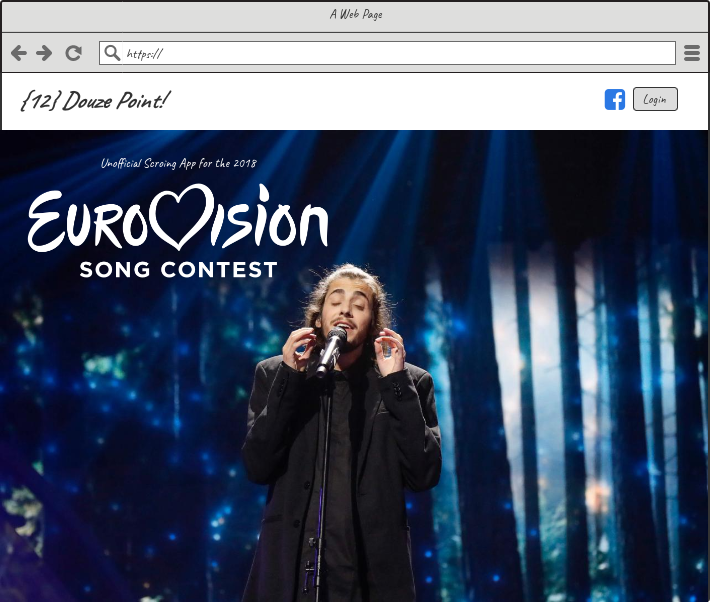

# The Idea
I could write an entire blog post on why I love the Eurovision Song Contest so much -- and maybe eventually I will. But for the sake of brevity [here's a link to the Wikipedia page](https://en.wikipedia.org/wiki/Eurovision_Song_Contest) about it and an image that sums it all up:

I was first introduced to the glory that is Eurovision in 2004 when I was in London for a semester abroad and happened to catch it on TV. It's a *huge* event in Europe, and while as many Europeans hate is as love it, it's as impossible to avoid as the Super Bowl or the Olympics, which makes it particularly interesting that so few Americans have heard of it.

I was re-introduced to Eurovision some years later by my friend Brendan, a die-hard fan with an encyclopedic knowledge of past contests and winners. For years, it had been his tradition to hold annual Eurovision parties with friends to watch and score the entries not according to the official system of the contest but based on his own custom criteria on hand-made scoresheets: up to 12 points each in the categories of song, dance, costume, and "eurocheese", with an optional field for arbitrary bonus points. Everybody rates each entry and then argues with each other about their ratings.

This was fun. A lot of fun. We do it every year.

So, naturally, when Brendan and I both made career transitions into web development we knew we wanted to turn his annual scoring game into a social web app that we, our friends, and any Eurovision lover with a healthy sense of humor could use. And thus, *Douze Points* was born.

# Designing the App

We knew we wanted this application to be a platform and demo for the web development skills we've learned but also to push and challenge us to go further. Using that criteria, the high-level shape of the app started to come together.

The core MVP features to be implemented in the first iteration of the app were soon fleshed out. When finished, users would be able to:  
  * log in with their Facebook account.
  * view past contests and entries (with embedded Youtube links)
  * make "scoresheets", each associated with a given year's contests
  * give each entry on a scoresheet a scoring, with up to 12 points assigned in each category just like in Brendan's home-made sheets.
  * view each other's scoresheets and profiles
  * leave comments on entries, scoresheets, and profiles
  * follow other users to see recent activity on the home page

Building off the tech stack we already knew, we started to visualize the completed app in the following parts:

# Backend API
First up was a JSON API that would be implemented using Rails 5 in API-only mode and a PostgreSQL database. Designing the database schema proved interesting given the requirements of the MVPs and the interconnectedness of the proposed tables. We settled on this configuration:
  * Countries would have a name and a url for their flag image.
  * Contests would have a year and have a foreign key pointing to their host country.
  * Entries would belong to a country and a contest, and have columns containing the url of an associated video, title of song, name of artist, and their final ranking and score in the official contest.
  * Users would have many scoresheets. Scoresheets would also need to belong to the contest they were scoring.
  * Scoresheets would have many scorings. Scorings would represent the set of scores a user gave to one individual entry, so it would serve a join table between scoresheets and entries and would contain the user's scores for the four categories and the bonus field.
  * Lastly, comments would be allowed to be associated with many of the other tables via Rails' polymorphic associations.

Here's a model of our proposed database:  

  

Backend routes and controllers were designed according to RESTful conventions and we would use jbuilder to shape our JSON responses.

# Frontend
For the app itself, we decided to go with React/Redux, with which we were already very familiar. We also decided to use create-react-app to quickly get started with developing. I've been in love with create-react-app for a while now and was itching to use it in a full-fledged project.

Key to group collaboration was to decide on stylistic conventions and a normalized state shape for our Redux store. We decided we would use prettier to help us keep to a consistent style (I'm a big fan of it as well!). Our driving guideline for state shape was to consistently store all resources in their slice of state under keys of their ids. Resources that referenced others (such as a scoresheet that had many scorings) would hold an array of the ids of the resources that they need (easily produced on the backend with ActiveRecord's #pluck method and our jbuilder views). With an array of scoring ids, for example, we could easily grab all the scorings that a scoresheet needed out of their slice of state without the need to iterate through all of the scorings stored there. Keeping the Redux store consistent and easy to use would save us a lot of pain down the road -- pain that we had both learned about the hard way on other projects.

When it came to the styling and UI, Brendan and I bounced around and also looped in my partner, Ian, who has a design background and who had expressed interest in helping us design and implement the project, particularly the frontend styling and React components. I'm a big fan of teamwork and collaboration, so I was excited to get another person's perspective on the project. After hearing what we wanted from the app, he went and made some very basic wireframes for us to start to get an idea of what it might look like.

  
  *The concept for the splash screen / landing page*

  
  *Scoresheets*

  
  *Detail view for individual entries*

We knew some or all of this might change once we got started, but we had a clear idea of how to begin. I volunteered to get both the backend Rails app and frontend React app started and to set up the login via Facebook.

This proved a bit more complicated than I expected, which will be the topic of part 2 of this series!
