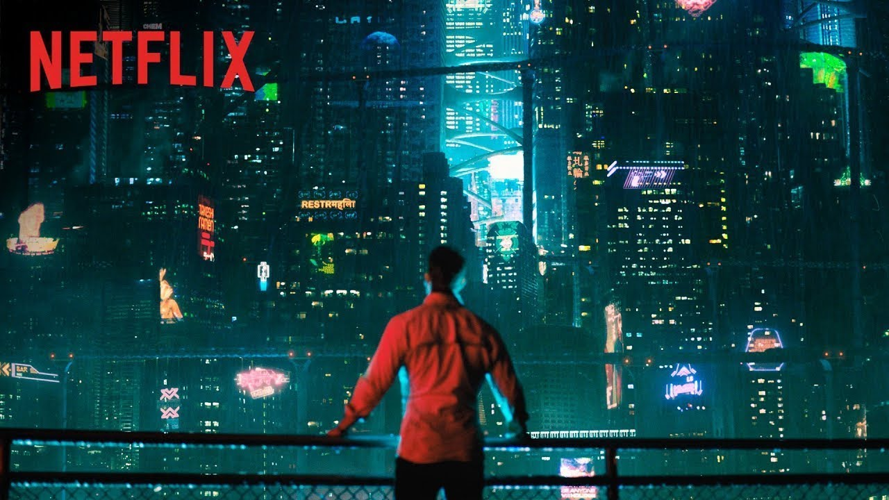
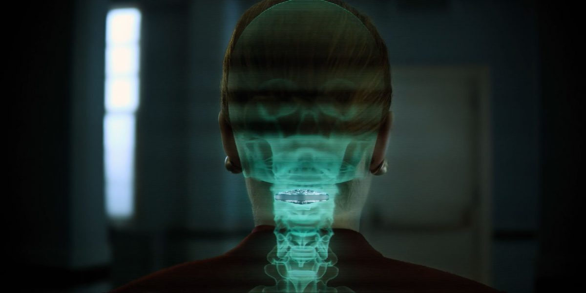
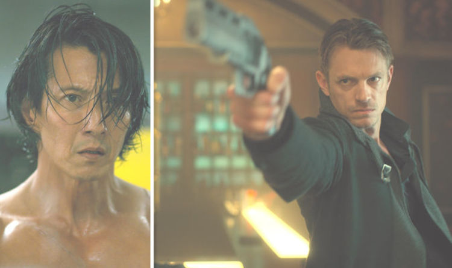
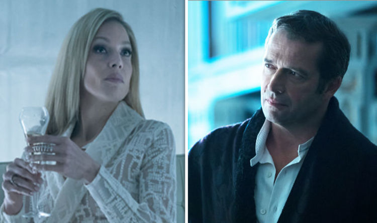
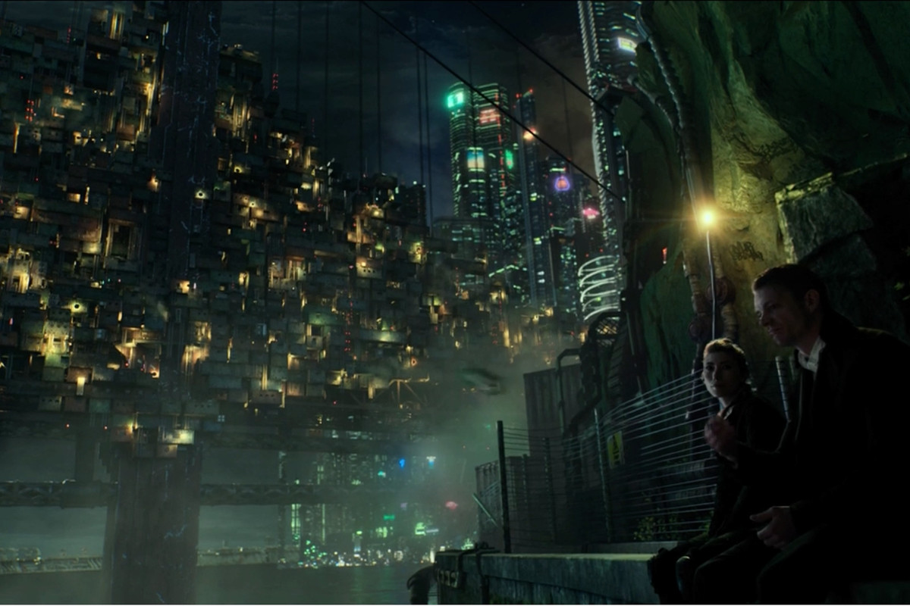

Science fiction is, at its core, a thought experiment. Take an idea about what human civilization might eventually be (no matter how probable or improbable) and carry it to its natural conclusion -- and then see what is revealed about us in the process. Science fiction often features spaceships, virtual worlds, lasers, and monsters, but its not _about_ those things. It's about us, a look at humans through the lens of the what-if premise.

Noir is totally different take on humanity, showing off the nitty gritty of our dark underside. It's a bleak modern take on the timeless hero's journey, with the detective starting out to unravel "the mystery" -- only to find in time that the mystery, the _question_, was not the one they thought it was. And, most importantly, that they themselves have been changed in the process of unraveling the truth. Revealing the secrets of the case unearths secrets about society, and most importantly secrets about the detective themselves.

Both genres entertain with evocative settings and larger-than-life characters, and both offer a certain appeal of escapism from the mundane aspects of day-to-day life, but they also contain hidden depths of a more philosophical bent. Perhaps this is why I like these genres so much. I particularly like resulting combo when you blend the two together, as in such notable films as _Blade Runner_ and its imitators. I myself once wrote a noir-esque novella about a murder taking place in a colony where all the inhabitants are clones of the same man, and of the clone who is tasked to find the killer. Clearly, the sci-fi noir blend brings out the nerdy fanboy in me.  

So you can imagine my excitement when I heard about _Altered Carbon_, the new sci-fi noir epic on Netflix. I don't tend to binge watch TV, even shows I like, preferring instead to digest each episode with a little space in between, but I made my way through _Altered Carbon_ within a little more than a week. Despite my enthusiasm, I tried to go into the series with lowered expectations. And yet, to my pleasant surprise, I liked so much about it and even (and this is so rare these days) felt fairly satisfied by the way it ended.

But I feel guilty for liking it. And a bit afraid to tell people that I enjoyed it. There's a lot going here, I need to unpack this a bit.

In the world of the show, future humanity has developed technology that allows their consciousness to be saved onto a cartridge or "stack" that sits at the base of the neck. As long as the cartridge is kept intact, the consciousness of that person never truly dies, no matter what happens to their body. And in fact, the stack can be moved from body to body -- the disconnect of mind and body, so pronounced in modern western cultures, is taken to an extreme limit. Now, a "person" _is_ the cartridge, and the body they inhabit is merely a temporary vehicle, a "sleeve" for their consciousness. The premise of the show could have been gimmicky except that, like in the best examples of sci-fi, the "what-if" thought experiment of the show is used to further both the plot and a deeper inquiry into human society and the human soul. Its a little ham-handed at times, but the pulply noir tone of the show makes usually makes it somehow work.

The basic plot is that protagonist Takeshi Kovacs is brought back into the world (his long-unused stack inserted into a new body) by the request of an extremely wealthy aristocrat, Laurens Bancroft, in order to solve his murder. Bancroft was killed days earlier, shot through the stack. This would be the end of most people, but being so immensely wealthy Bancroft is able to back up his consciousness to the cloud every 48 hours and thus able to be revived inside one of his many clones. Kovacs is tasked by Bancroft to find his murderer and figure out what happened, since Bancroft himself has no memory of anything that happened after his most recent back-up.

Many of the noir archetypes are present: Kovacs himself is the jaded, cynical detective with a spotted past. Whereas many of the classic noir stories had the detective as a war veteran or some other shadowed backstory, Kovacs is a former member of a legendary revolutionary movement whose operatives were renowed for their skill and ruthless efficiency. When he's awakened at the start of the story, his revolution has been dead for over two hundred years and his association with it is seen as a quaint, interesting relic from the past, leaving him literally a man-out-of-time. Bancroft's wife is the classic femme-fatale, a woman with a motive and a capacity for brutality who uses her sexuality to try to distract and control the investigation. And there's even the hardened but still idealistic cop (in the form of Lieutenant Kristin Ortega) trying to fight the injustices of society despite the cynical nihilism of her superiors. These noir tropes are enmeshed in sci-fi/cyberpunk ones: virtual reality, sentient AIs, advanced psychotropic drugs, cloning, prosthetic limbs, and communication devices embedded into eye-balls all make an appearance in the plot. It all somehow works together, mostly.

And the over-arching thought experiment -- what if humans found the key to immortality, what if humans were no longer bound to one body -- keeps popping up in new and interesting ways. Lieutenant Ortega "spins up" the stack of her grandmother in order to bring her to her family's Dia de los Muertos celebration, as is apparently tradition. She does so using whatever sleeve she has at hand in the police station, the body of a bearded, burly, tattooed gang member. One of the antagonists, the criminal renegade named Dimitri, has made an illegal copy of his stack that he refers to as his brother, and is renowned for jumping from sleeve to sleeve as part of his nefarious activities -- meaning that at least 3 actors that I can remember play Dimitri at some point during the show. Some devout faithful (the neo-Catholics specifically, we are told) believe that while stacks preserve the mind, the soul dies with the body, and thus refuse to be spun back up after their sleeve dies.

All this, together with engaging but not too rushed pacing, makes the show very watchable. And the overall arc of the character and the revelations of the plot are, while a bit convenient at times, satisfying and interesting. So why do I feel _guilty_ for liking this? If its not exactly highbrow, if its a bit pulpy and silly, well that's never stopped me from unapologetically loving something before.

The problem is that the show is problematic -- but not just that its problematic, which I would know how to deal with, but _problematically_ problematic. What am I supposed to do with that?

The most obvious elephant-in-the-room is that Takeshi Kovacs, a half-European, half-Japanese man, is played throughout the series by a white actor. There's an in universe, perfectly valid explanation for this in that Bancroft had Kovacs spun up specifically in the sleeve of (minor spoiler) policeman and Ortega's lover Riker, a white man, to make use of Riker's strength and military reflexes but also as a big middle finger to Ortega herself. People mistake Kovacs for Riker, and he generally has to deal with being in a body that is not his own. He's no stranger to this, however, having jumped from sleeve to sleeve a lot during his time as a revolutionary and beforehand when he was in the military. And the original Takeshi Kovacs is played in extensive flashbacks as both a child and a revolutionary by actors of Asian descent. _And_ this is exactly what happens in the book and they are being true to the source material. _And_ the actor (Joel Kinnaman) is actually pretty great in the part, considering he's a brooding hard-boiled detective who shows little emotion.

But despite all that, and despite the show wrestling with what things like racial and gender identity even _mean_ when your body no longer defines who you are, there's no escaping that this is a story about a half-Asian man and the lead actor is white. There's been a lot of attention on this kind of whitewashing in casting lately, and for good reason, and even though I think this is less egregious than other examples, in the context of that on-going conversation it seems like an awkward choice on the part of the producers.

I tried to brush aside this kind of critique given that the show does such an excellent job at explaining and wrestling with the disparity between Kovac's identity and the body he is (temporarily) inhabiting, a major theme of the show across all the characters. But again and again, I thought of other recent examples of whitewashing of Asian roles by white actors -- examples such as Scarlett Johanssen in _Ghost in the Shell_, a film which similarly tried to explain away the casting in-world by depicting a character whose entire identity, including her race, had been stolen from her when she had been inserted into a robotic body. Like _Altered Carbon_, _Ghost_ tried to make the casting okay by wrestling with the difficult implications of it, certainly a step forward (maybe a tiny step) from previous whitewashed casting where its not discussed or addressed at all.

But in both cases, we cannot dismiss that reality that ultimately the decision of which actor to cast was made in the real world and for real world reasons. White actors were placed in those roles because of the belief that people would be less likely to watch a show or movie with a non-white lead. It would be naive to think that this entrenched Hollywood opinion (which blockbusters like _Black Panter_ and _Get Out_ are hopefully disproving, he said idealistically) had nothing to do with the casting no matter how fully addressed it is in world. And that's messed up.

And then there is the show's treatment of women. Like many noir stories, women are frequently victims and the show ultimately ends up revolving around a prostitution service for the rich where they are allowed to torture and kill (like, _actually_ kill, destroy their stacks) girls in addition to having sex with them. The idea is that the basically immortal rich have grown so numb and desensitized that only these kinds of extremes can get them off anymore. But, similar to the whitewashed casting, the relentless depiction of violence towards and objectification of women makes it hard to feel totally at ease with the show. And there's Mrs. Bancroft, of course, a prowling she-wolf sexual predator who is basically a pure villain all but twirling an invisible moustache as she tries to seduce Kovacs, even offering him a life of luxury on an island full of her clones, his own personal harem, in exchange for him to give up the investigation. Whereas Bancroft himself is flawed and ultimately a bad guy, he's interesting, complicated, and fully fleshed out as a character. His wife is reduced to a femme fatale archetype cliche for the majority of the show. And there's another female character, deeply traumatized after being attacked by a group of men, who's redemption arc is simply that she is trained to defend herself and become an instrument of violent vengeance rampaging through groups of men kicking some serious butt. And while it was fun to watch her dispensing a kind of haggard justice, it felt a bit wrong to suggest that learning to kick and punch is all it takes to recover from that kind of deep trauma, not to mention that her "beat up the dudes" moments still somehow managed to sexualize her in costume and choreography for the male gaze.

And yet! Ortega is a badass Latina police office, interesting, flawed, very likeable, though a bit obsessed with Kovacs and its a few episodes before we understand why. But I loved her! Her heritage and her family are a big part of her identity and the plot of the show without feeling like a gimmick. Kovacs recruits other helpers in his investigation, including a bi-racial couple and their daughter and, it occurred to me while watching with a little guilty surprise, black/white couples are still rarely seen on TV. For some of the show, the wife of the couple has been put into a man's body against her will, and it is touching to see how easily her husband accepts that this man is his wife after only a little initial awkwardness -- the lack of gay panic from the male character in the situation was refreshing. The legendary leader of the revolution and Kovac's hero (and, in many hazy dreams and waking visions, the manifestation of his subconscious) is a black woman who is a heroic warrior, intelligent and passionate scientist, and a wise mentor and teacher. But... of course she falls for Kovacs during the backstory flashbacks. The love story is handled well and stays true to her character, but I couldn't help but feel cheated that this character ended up being motivated by love for a man, given that she had previously been about so much more than that.

Still, while the Bancrofts are white as can be, the rest of the cast of the show is as diverse as any show made in 2017 should be.  But this only makes the decision to cast a tall blonde white actor, a very conventional leading man, as Kovacs the more out of place. And yet (again)! If the story is about him being spun up in a body that is not his own, would it have worked in telling that story if the new body was _also_ Asian or half-Asian? If he had been played by a non-Asian actor from some other racial background, would that have been much less problematic? What about when Ortega's grandmother is brought back (memorably and rather adorably) in the body of the bearded, burly white gangster, only for Dimitri to possess that same body later in the show (yes, one actor played 3 roles). Was that problematic, or is this kind of racial and gender bending the _point_ of the show and its thought experiment? It's impossible for me to discuss the reality of the casting and the dynamics of gender separate from the meanings and themes of the show and the character, and it all turns into a jumbled mess of conclusions. I have no clear or easy way to categorize this casting, to excuse it entirely or to condemn it entirely.

And we humans are not great at dealing with things we can't fully categorize. I ultimately was able to categorically condemn the casting of Scar Jo in _Ghost in the Shell_, even though she gave a decent performance and the original creator of the anime on which it was based was supposedly in favor of her taking the part. All things said and done, none of that justified the decision for me. And it didn't hurt that the movie wasn't very good anyway, the definitely made it an easier decision. But though I know some of my friends have found it equally as easy to denounce, I find _Altered Carbon_ much harder to parse. The issues feel more complicated and, mucking up my judgment, I rather liked it. Some episodes had me on the edge of my seat. Like all good sci-fi, it asks hard questions along the way towards telling a silly fun story, and I'm left pondering a lot of things about human consciousness, identity, mortality, and relationships. But I can't fully be at ease with it all either. I can forgive some of the chunky dialogue, as it suits the genre. I can forgive the rather wrapped-up-too-neatly ending, as it fits the genre as well. But I'm left troubled by casting complications and the depiction of women without being able to definitively say what should have been different that would have left me less disturbed.

The first season wrapped up neatly enough that I would be content if Netflix never ordered a second -- and its difficult to say how well it went over with audiences anyway, since I've yet to meet anybody who liked it nearly as much as I did. But if there should be a second season, and given that there are additional books in the series on which it was based that's theoretically possible, there's an opportunity for some changes. At the end of the final episode, Kovacs surrenders Riker's body so that Riker can be returned to his former life -- which means that Kovacs, in his return in a second season, should be played be a completely different actor. This enigmatic protagonist could theforece continue to be played by multiple actors over the life of the show, a kind of Dr. Who situation. That would not only further the thought experiment of this strange world but also allow for interesting shades of the character to be brought to light by different actors. Riker could return, theoretically, with that actor now playing him in a supportive role instead of Kovacs. But should a second season come along with Joel Kinnaman as Takeshi Kovacs again, against all reason both in the world of the show and in our world, I will find it quite difficult to excuse and would likely not watch it. I want to believe that Netflix wouldn't do that.

But maybe I'm being overly optimistic?
