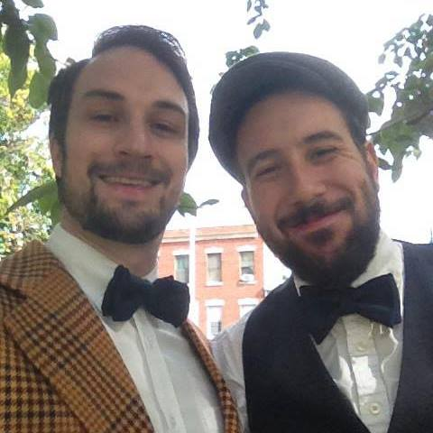

Hi, I'm Matt. I'm a life-long lover of tech, literature, video games, the arts, and bad puns. Basically an ideal day for me would involve a few hours of a PC strategy game, making a cool web app for people to use, telling at least one joke that gets a groan from 3 or more people, and then attending an opera or play in the evening (preferably *Tosca* or anything Shakespeare). I like in-depth conversations with people who have thoughtful opinions and points of view, with a particular love for serious dialogue about non-serious topics. I consider myself an introvert who loves people and collaboration. Personality type: INFP, religious affiliation: existential detective.

I live in beautiful Greenpoint, Brooklyn, with my partner of ten years, Ian,  and our obnoxious and yet somehow-still-loveable cat.

*It's a blurry photo. But let's just pretend its an artsy Instagram filter, okay?*

I am passionate about life-long learning. I believe we should be constantly re-imagining and shaping ourselves throughout our lives. I strive to be open to new ideas and opinions, and to constantly scrutinize and re-evaluate my own beliefs and worldview.

Writing about stuff is my key way of processing it. Welcome to my blog.
